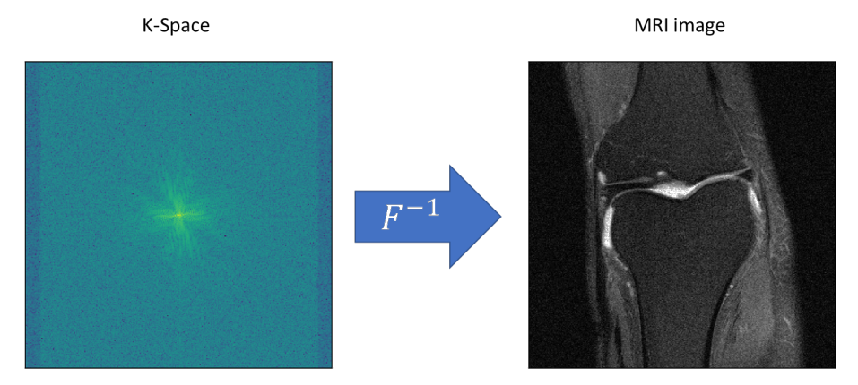
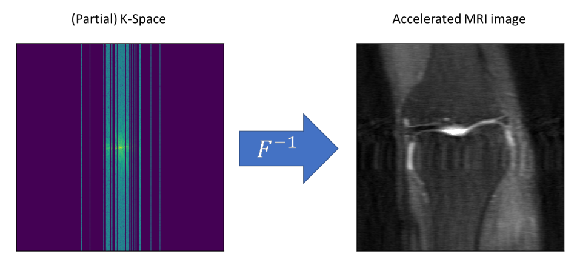
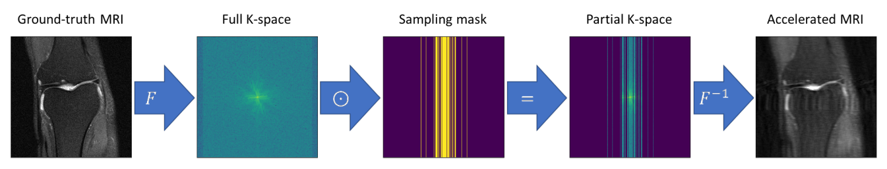
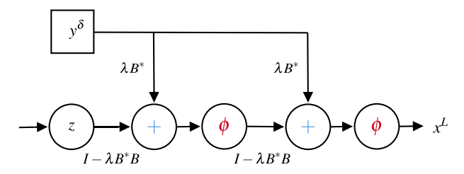
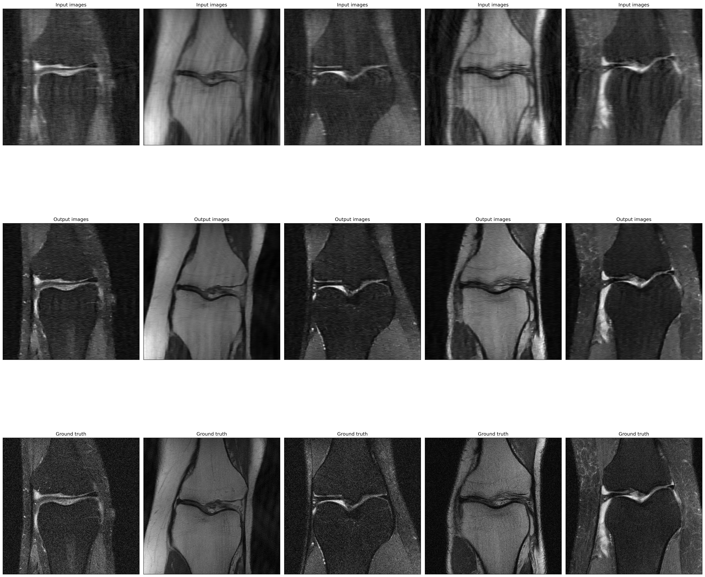

# MRI Reconstruction using Deep Learning-Based Proximal Gradient Descent

This project implements a deep learning-based Proximal Gradient Descent (PGD) algorithm to reconstruct MRI images from under-sampled k-space measurements. It is inspired by the paper "Regularization by Architecture: A Deep Prior Approach for Inverse Problems." The goal is to accelerate the MRI acquisition process by using fewer k-space measurements, ultimately reducing scan time while maintaining high-quality image reconstruction.

The neural network acts as the proximal operator in the PGD framework, iteratively reconstructing images from partial k-space data. This approach takes advantage of compressed sensing techniques to optimize data acquisition in MRI.

The project utilizes the fastMRI dataset, a collaborative effort between Facebook AI Research (FAIR) and NYU Langone Health, which provides real-world knee MRI data for training and testing the model.

Key Features:
- Efficient MRI reconstruction: Leverages under-sampled k-space data to reconstruct MRI images, reducing acquisition time.
- Deep learning integration: A neural network serves as the proximal operator in the Proximal Gradient Descent framework.
- Compressed sensing: The project employs compressed sensing principles to reduce the number of k-space measurements required, maintaining the quality of the reconstructed images.

## Methodology

MRI scans rely on capturing k-space data, which is a representation of the spatial frequency information of an image. The MRI reconstruction process converts this k-space data back into an image using an inverse Fourier transform.

Under-sampled k-space data can be reconstructed into MRI images using advanced algorithms like Proximal Gradient Descent.

## Reconstruction Pipeline

The following figure shows the full pipeline from the ground truth MRI to the under-sampled k-space data and the resulting accelerated MRI image.

## Neural Proximal Gradient Descent

The Neural Proximal Gradient Descent (NPGD) algorithm works iteratively to reconstruct MRI images from partial k-space measurements by optimizing the image with a neural network acting as the proximal operator.

## Results

Here are the results from applying the PGD-based model. The figure shows the input (accelerated MRI), the output (reconstructed MRI), and the ground truth MRI for comparison.

The model successfully reconstructs MRI images from under-sampled k-space data, significantly reducing scan time while maintaining high-quality output.
